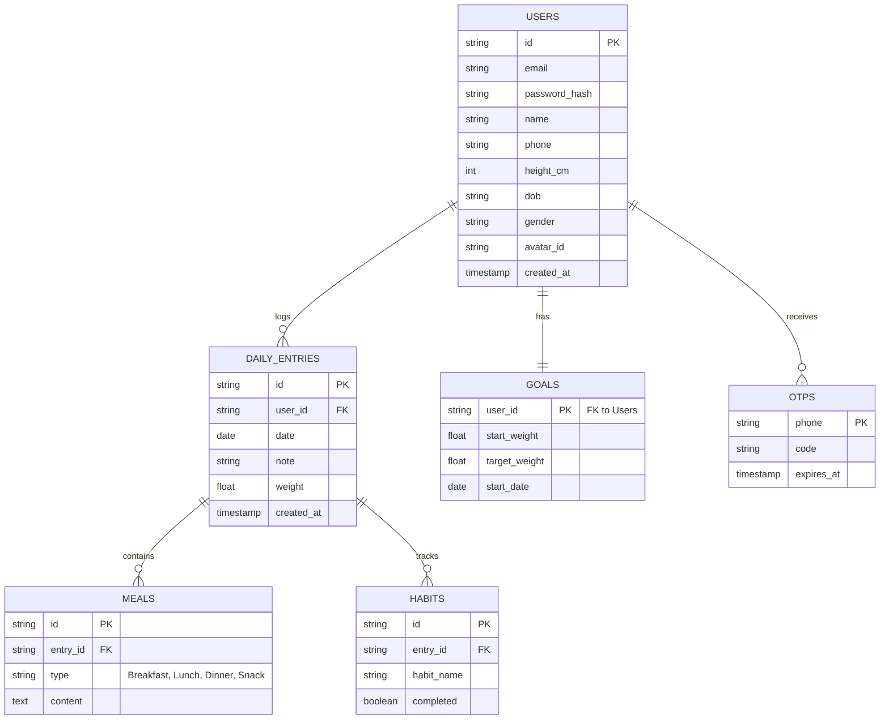

```mermaid
erDiagram
    USERS ||--o{ DAILY_ENTRIES : "logs"
    USERS ||--|| GOALS : "has"
    USERS ||--o{ OTPS : "receives"

    DAILY_ENTRIES ||--o{ MEALS : "contains"
    DAILY_ENTRIES ||--o{ HABITS : "tracks"

    USERS {
        string id PK
        string email
        string password_hash
        string name
        string phone
        int height_cm
        string dob
        string gender
        string avatar_id
        timestamp created_at
    }

    DAILY_ENTRIES {
        string id PK
        string user_id FK
        date date
        string note
        float weight
        timestamp created_at
    }

    MEALS {
        string id PK
        string entry_id FK
        string type "Breakfast, Lunch, Dinner, Snack"
        text content
    }

    HABITS {
        string id PK
        string entry_id FK
        string habit_name
        boolean completed
    }

    GOALS {
        string user_id PK "FK to Users"
        float start_weight
        float target_weight
        date start_date
    }

    OTPS {
        string phone PK
        string code
        timestamp expires_at
    }
```
